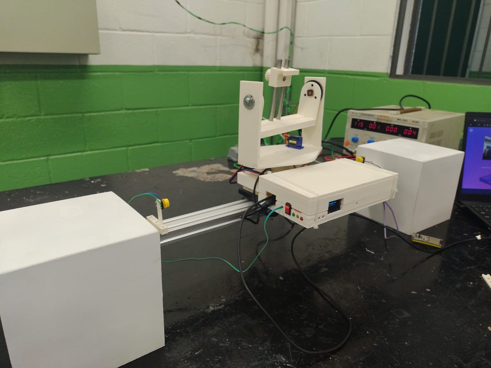
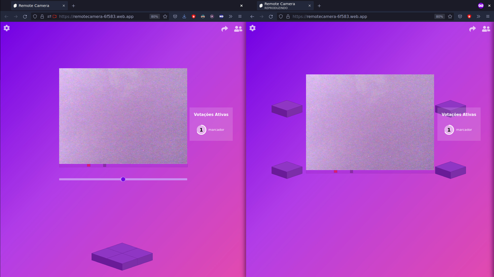

# Remote Camera - Controle a sua câmera a distância!

> Este programa faz parte do meu projeto de TCC de técnico em eletrônica, por isso foi pensado para ser utilizado em conjunto com a parte física. Sem ela isso é apenas um programa de vídeo chamadas.
>
> 

O Remote Camera permite que outras pessoas controlem a sua câmera afim de facilitar a interação apresentador-expectador no cenário de reuniões online.

O apresentador pode fornecer acesso total a câmera ou utilizar um sistema de votação com base em pontos chave para a câmera

Link para acessar a versão de navegador: https://remotecamera-6f583.web.app/
=======

# Remote Camera - Controle a sua câmera a distância!

> Este programa faz parte do meu projeto de TCC de técnico em eletrônica, por isso foi pensado para ser utilizado em conjunto com a parte física. Sem ela isso é apenas um programa de vídeo chamadas.
> 
> Link para acessar a versão de navegador: https://remotecamera-6f583.web.app/

A programação do projeto foi feita para duas plataformas diferentes: para o Arduino, escrito primariamente na linguagem C, e para plataformas web, que permite qualquer dispositivo com um navegador de internet usar. Essas duas plataformas trabalham em conjunto para garantir o funcionamento do projeto, permitir que várias pessoas assistam à transmissão da câmera e controlem sua posição e angulo de visão.

## Visão Geral

Ao ligar o arduino, uma rede wifi temporária é criada, que disponibiliza uma pagina de configuração em que pedido as credenciais de uma rede wifi fixa que possua internet. Assim que o arduino se conecta a internet é armazenado um código aleatório no servidor do projeto, que quando inserido na plataforma web o associa a conta e o deixa pronto para receber comandos.

Logo quando o usuário acessa o site é pedido um nome de identificação. E assim surgem duas escolhas: o usuário pode transmitir a imagem da própria câmera ou se conectar a câmera de outra pessoa. Caso a escolha seja se conectar uma câmera externa, é necessário digitar um código de chamada que, se for válido, o redirecionará para a tela principal, onde há a transmissão da câmera externa, a lista de usuários conectados e os controles da câmera. E caso a escolha seja transmitir a imagem da própria câmera, será pedido o código de identificação da parte física e se correto será redirecionado para a tela principal, igual a da primeira opção com a diferença que por ser o dono da chamada o usuário possui acesso total aos controles da câmera e pode alterar o nível de acesso de cada espectador.

### Controles

Foram implementadas duas formas de controlar a câmera através da plataforma web, que é: por botões que controlam livremente o ângulo da câmera e por pontos-chave que podem ser colocados para marcar uma posição específica.

Em relação aos pontos-chave, dependendo do nível de acesso do espectador eles podem atuar de forma diferente. Se o nível de acesso for alto, ao pressionar os botões a câmera irá se mover imediatamente para a posição configurada, mas se o nível de acesso for normal, iniciara-se uma votação em que se metade os espectadores votarem a favor a câmera se moverá, caso contrário não.

## Detalhes técnicos

### Servidor

O servidor é uma parte crucial para o funcionamento do projeto, pois ele é a ponte entre as diferentes plataformas e gerência os dados dos usuários. Para evitar os custos de um servidor convencional (onde se aluga um computador que fica 24 horas conectado à internet e capaz de executar qualquer comando desejado) foi escolhido como servidor do projeto o Firebase, uma plataforma desenvolvida pelo Google para o desenvolvimento de aplicativos web e móveis. O Firebase possuí diversas vantagens, porém o motivo por ser escolhido foi a sua facidade de uso, gerenciar de forma automatica as contas criadas, possuir um banco de dados em tempo real e ser de graça.

### Transmissão de vídeo

Embora o Firebase tenha muitas vantagens, ele tem um grande ponto negativo: não permitir a execução de programas. Com isso não é possível utilizar o servidor como meio-termo para a transmissão da imagem da câmera. Porém, existe uma tecnologia capaz transmitir dados entre dois usuários sem um intermediário direto, ela é chamada de WebRTC. Ela pode transmitir texto, áudio e vídeo sem a necessidade de um intermediador, mas como o WebRTC suporta apenas conexões de apenas dois usuários por vez, a implementação seria complicada. E para resolver esse problema foi utilizado um Framework chamado PeerJS para facilitar o desenvolvimento. Ele utiliza um servidor próprio para iniciar as conexões e encapsula o WebRTC de forma a ser como transmissor para diversos espectadores, invés de apenas transmissor-espectador, o que torna tudo mais simples.
